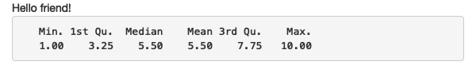
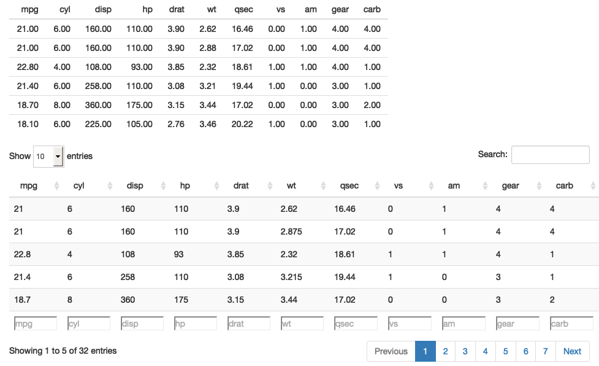

```{r xaringan-themer, include = FALSE}
library(xaringanthemer)
style_mono_accent(
  base_color = "black",
  header_font_google = google_font("Josefin Sans"),
  link_color = "deeppink",
  text_font_size = "28px",
  footnote_font_size = "22px"
)
```

```{r xaringanExtra, echo=FALSE}
xaringanExtra::use_xaringan_extra(c("tile_view", "logo", "tachyons"))
xaringanExtra::use_panelset()
xaringanExtra::use_tachyons()
```

```{r setup, include=FALSE}
options(htmltools.dir.version = FALSE, eval=FALSE)
```

# Introduction
Today we will learn about Shiny. Shiny is an R package that allows one to creative interactive web apps. 

You can use R and expose it into a web application that you can share through the browser!

You can make really cool apps with minimal effort and technical skills.


---
# What do people use Shiny for?

1. Create dashboards that can track important metrics 
1. Replace many paged PDFs with interactive apps
1. Communicate complex models to non-technical audience
1. Make complex R analyses available to users with no programming background
1. Create interactive demos 

---
# What will we learn today?
1. Basics of Shiny - so you can get up and running
1. Basics of app structure
1. Useful UI (user interface) components
1. Foundations of reactive programming

---
# Installing and Loading Shiny

We'll create a simple shiny app

Install shiny 

```{r, eval=FALSE}
install.packages("shiny")
```

Load shiny 

```{r, eval=FALSE}
library(shiny)
```

---
# Basics of a shiny app
Two key components for every shiny app:
1. UI -- defines how your app **looks**
2. Server -- defines how your app **works**

Shiny uses reactive programming. This automatically updates outputs when inputs are changed. 

3. Reactive expressions (we aren't going to cover this in detail)

---
# Create first Shiny app
Simplest way to create a shiny app: create a directory for your app. Put a single file called `app.R` in it. The `app.R` file will tell Shiny how your app *looks* and *works*.

---
# RStudio tip: Create Shiny app

Shiny apps can easily be made from RStudio. 

.pull-left[
* Create a new directory and an `app.R` file in one step. Click File > New Project. Select New Directory and Shiny Web Application
]

---
# Shiny app template

.pull-left[
```{r, eval=FALSE}
library(shiny) 

ui <- fluidPage(
  
)

server <- function(input, output, session) {
  
}

shinyApp(ui, server)
```
]

.pull-right[
What does this do?
1. It calls `library(shiny)`
1. It defines the user interface (the HTML)
1. It specifies the behavior of our app by defining a `server` function. Right now its empty so it doesn't do anything. 
1. It executes `shinyApp(ui, server)` to build and start a Shiny app from UI and server. 
]

---
# Running and stopping

A few ways to run the app:

* Click **Run App**
* Use keyboard short cut: `Cmd/Ctrl` + `Shift` + `Enter`
* Run `shiny::runApp()` in the console.


---
# Listening ...

Look at RStudio and look at the console. You'll notice that it says the something like the following:

```
#> Listening on http://127.0.0.1:3827
```

* app is being hosted at 127.0.0.1 (which is a standard IP address for your local computer).
* assigned port -- 3827 is the assigned port number

You can enter that URL into the browser and it will open your app. 

---
# How to stop the app
While Shiny is running -- R is busy. 

.pull-left[
What's happening?
* R prompty isn't visble
* console toolbar displays stop sign
* you can't run new commands at R console until shiny stops
]

.pull-right[
How to stop it:
* Click the stop sign on the R console toolbar
* Click console and press `Esc` (in RStudio).
* Close ths Shiny app window
]

---
# Basic Shiny app workflow
1. Write some code
1. Start the app
1. Play with the app
1. Write some more code
1. Repeat

---
# UI Basics

```{r, eval=FALSE}
library(shiny)

ui <- fluidPage(
  # Title of your application
  titlePanel("Hello Shiny"),
  # Sidebar layout  
  sidebarLayout(
    position = "left",
    # Sidebar panel for inputs ----
    sidebarPanel("Place inputs here"),
    # Main panel for displaying outputs ----
    mainPanel("Results will go here")
  )
)

server <- function(input, output) {
}

shinyApp(ui = ui, server = server)
```


---
# Adding UI controls
We can add some inputs and outputs to our UI.

.pull-left[
Example of `ui`:
```{r, eval=FALSE}
ui <- fluidPage(
  selectInput("dataset",
              label = "Dataset",
              choices = ls("package:datasets")),
  verbatimTextOutput("summary"),
  tableOutput("table")
)
```
]

.pull-right[
What does this do?
* `fluidPage()` is a layout function that sets up basic visual structure of the page
* `selectInput()` is input control that lets user interact with app by providing a value.
* `verbatimTextOutput()` and `tableOuput()` are output controls that tell shiny where to put rendered output
]

---
# What are all these crazy words you just used?
Layout functions, inputs, and outputs all have specific users, but they are basically fancy ways to generate HTML. 


---
# Adding behavior

Bring output to life by defining them in **`server`** function.

Shiny uses reactive programming to make apps interactive.

What does that mean?

It tells Shiny how to perform a computation, not ordering Shiny to actually go do it.

---
# Instructions in the server 

.pull-left[
```{r, eval=FALSE}
server <- function(input, output, session) {
  output$summary <- renderPrint({
    dataset <- get(input$dataset,
                   "package:datasets")
    summary(dataset)
  })
  
  output$table <- renderTable({
    dataset <- get(input$dataset, 
                   "package:datasets")
    dataset
  })
}
```
]

.pull-right[
What is this doing?

]

---
# Strategy for less duplicative code
Reducing duplication

.pull-left[
```{r, eval=FALSE}
server <- function(input, output, session) {
  # Create a reactive expression
  dataset <- reactive({
    get(input$dataset, 
        "package:datasets")
  })

  output$summary <- renderPrint({
    # Use a reactive expression by calling it like a function
    summary(dataset())
  })
  
  output$table <- renderTable({
    dataset()
  })
}
```
]

.pull-right[
What is this doing?
* creates a reactive expression `reactive({...})` and assigning it to a variables
* unlike a function, only runs the first time it's called. caches its results until next update.
* works more efficiently. only needs to retreive dataset once
]

---

class: center, middle

# Front-end (UI Basics)

---
# Basic UI
Reminder: Shiny encourages separation of code that generates UI (the front end) and the server code (backend).

Here we'll focus on the front end. 

What we'll cover:
1. HTML inputs
1. HTML outputs
1. Layouts

---
# Inputs: Common structure of inputs
All input functions have three important parameters:

**First parameter**: `inputId`
* This is an identifier to connect front end (UI) with back end (server). 

e.g. if your UI has input ID `"name"`, the server function will access it with `input$name`

Important constraints for `inputId`
1. must be simple string that contains only letters, numbers, and underscores (no special characters besides these)
1. it must be unique. if it's not unique, the server function will be confused

---
# Inputs: Common structure of inputs

**Second parameter**: `label`
* This creates a human readable label for the control.

**Third parameter**: `value`
* This lets you set a default value.

```{r, eval=FALSE}
sliderInput(inputId = "min", 
            label = "Limit (minimum)",
            value = 50, 
            min = 0, 
            max = 100)
```

---
# Overview of input options
1. Free text
1. Numeric inputs
1. Dates
1. Limited choices
1. File uploads
1. Action buttons


---
# Input: Free text
Create text inputs in your Shiny app

.pull-left[
```{r, eval=FALSE}
ui <- fluidPage(
  textInput("name",
            "What's your name?"),
  passwordInput("password",
                "What's your password?"),
  textAreaInput("story",
                "Tell me about yourself", 
                rows = 3)
)
```
]

.pull-right[
How your Shiny app will look:

]


---
# Input: Numeric inputs
Create a text box with `numericInput()`. Or create a slider with `sliderInput()`. 

.pull-left[
```{r, eval=FALSE}
ui <- fluidPage(
  numericInput(
    "num", "Number one", value = 0, 
    min = 0,  max = 100
  ),
  sliderInput(
    "num2", "Number two", value = 50,
    min = 0, max = 100
  ),
  sliderInput(
    "rng", "Range", value = c(10, 20),
    min = 0, max = 100
  )
)
```
]

.pull-right[
How your Shiny app will look:

]

If you supply a length-2 numeric vector for the default value of sliderInput(), you get a “range” slider with two ends.

---
# Input: Dates

Collect a single date with `dateInput()` or a range of dates with `dateRangeInput()`. 

.pull-left[
```{r, eval=FALSE}
ui <- fluidPage(
  dateInput("dob",
            "When were you born?"),
  dateRangeInput("holiday",
                 "When do you want to go on vacation next?")
)
```
]

.pull-right[
How your Shiny app will look:

]

Dates format default to US style. Adjustment arguments in functions for international target audiences. 

---
# Input: Limited Choices

There are two different approaches to allow the user to choose from a prespecified set of options: `selectInput()` and `radioButtons()`.

.pull-left[
```{r, eval=FALSE}
animals <-
  c("dog", "cat",
    "mouse", "bird",
    "other", "I hate animals")

ui <- fluidPage(
  selectInput("state",
              "What's your favourite state?",
              state.name),
  radioButtons("animal",
               "What's your favourite animal?",
               animals)
)
```

]

.pull-right[
How your Shiny app will look:

]

---
# Input: Limited Choices: 

`checkBoxGroupInput`

.pull-left[
```{r, eval=FALSE}
ui <- fluidPage(
  checkboxGroupInput("animal", "What animals do you like?", animals)
)
```
]

.pull-right[

]

---
# Input: File uploads

Allow the user to upload a file with `fileInput()`:

.pull-left[
```{r, eval=FALSE}
ui <- fluidPage(
  fileInput("upload", NULL)
)
```
]

.pull-right[
How your Shiny app will look:

]

`fileInput()` requires special handling on the server side. Look at the Mastering Shiny Book for more info.

---
# Input: Action buttons

```{r, eval=FALSE}
ui <- fluidPage(
  actionButton("click", "Click me!"),
  actionButton("drink", "Drink me!", icon = icon("cocktail"))
)
```


Actions links and buttons are most naturally paired with `observeEvent()` or `eventReactive()` in your server function. 

---

# Output 
Outputs in the UI create placeholders that are later filled by the server function. 

If in your UI specs create an output with `"plot"`, you'll access it using server function `output$plot`

The output function is coupled with a `render` function on the backend. 

Three types of output:
1. Text
1. Tables
1. Plots


---
# Output: Text

.pull-left[
```{r, eval=FALSE}
ui <- fluidPage(
  textOutput("text"),
  verbatimTextOutput("code")
)
server <- function(input, output, session) {
  output$text <- renderText({ 
    "Hello friend!" 
  })
  output$code <- renderPrint({ 
    summary(1:10) 
  })
}
```

]

.pull-right[
* Output regular text with `textOutput()`
* Ouput fixed code and console output with `verbatimTextOutput()`

]

* `renderText()` combines the result into a single string, and is usually paired with `textOutput()`
* `renderPrint()` prints the result, as if you were in an R console, and is usually paired with `verbatimTextOutput()`.

---
# Output: Tables
There are two options for displaying data frames in tables:

`tableOutput()` and `renderTable()` render a static table of data, showing all the data at once.

`dataTableOutput()` and `renderDataTable()` render a dynamic table, showing a fixed number of rows along with controls to change which rows are visible.

---
# Output: Tables

.pull-left[
```{r, eval=FALSE}
ui <- fluidPage(
  tableOutput("static"),
  dataTableOutput("dynamic")
)
server <- function(input, output, session) {
  output$static <- renderTable(head(mtcars))
  output$dynamic <- renderDataTable(mtcars, options = list(pageLength = 5))
}
```
]

.pull-right[

]

---
# Output: Plots
.pull-left[
```{r, eval=FALSE}
ui <- fluidPage(
  plotOutput("plot", width = "400px")
)
server <- function(input, output, session) {
  output$plot <- renderPlot(plot(1:5), res = 96)
}

```
]


.pull-right[
By default `plotOutput()` takes up full width of container and its 400px wide. 
* Override with `height` and `width` arguments
* `res=96` will get Shiny plots to match RStudio as closely as possible
]

---
# Output: Downloads
You can let users download files with a `downloadButton()` or `downloadLink()`. These require a bit of technique so I encourage you to look it up. 

https://mastering-shiny.org/action-transfer.html#action-transfer

---
# Layouts:

Now that we know inputs and outputs, we need to be able to arrange them on a single page. 

* Provides high-level visual structure of app
* `fluidPage()` is the basic layout. This is the style used by most apps.


---
# Layouts: Overview
.pull-left[
```{r, eval=FALSE}
fluidPage(
  titlePanel("Hello Shiny!"),
  sidebarLayout(
    sidebarPanel(
      sliderInput("obs",
                  "Observations:",
                  min = 0,
                  max = 1000, 
                  value = 500)
    ),
    mainPanel(
      plotOutput("distPlot")
    )
  )
)
```
]

.pull-right[
Try reading it like this:

```{r, eval=FALSE}
fluidPage(
  titlePanel(),
  sidebarLayout(
    sidebarPanel(
      sliderInput("obs")
    ),
    mainPanel(
      plotOutput("distPlot")
    )
  )
)
```

- You can guess what the app is going to behave like. Title bar at the top. Followed by a sidebar (with a slider), with a main panel containing a plot.

]

---
# Layouts: Page Functions

Most important layout function is `fluidPage()`

.pull-left[

]

.pull-right[
* `fluidPage()` - HTML, CSS, and JavaScript that shiny needs. 
* [bootstrap](https://getbootstrap.com) that provides additional features. 

Two common structures:
1. page with sidebar 
1. multirow app
]


---
# Layouts: Page with sidebar
`sidebarLayout()`, `titlePanel()`, `sidebarPanel()`, and `mainPanel()`, makes it easy to create a two-column layout with inputs on the left and outputs on the right

.pull-left[
```{r, eval=FALSE}
fluidPage(
  titlePanel(
    # app title/description
  ),
  sidebarLayout(
    sidebarPanel(
      # inputs
    ),
    mainPanel(
      # outputs
    )
  )
)
```
]

.pull-right[

]

---
# Layouts: Page with sidebar

Let's create a basic app that demonstrates central limit theorem!

Open up `app.R` in the directory ...

---
# Layouts: Multirow

`sideBarLayout()` under the hood is built on flexible multi-row layout. You can use this to create more complex apps. 

.pull-left[
```{r, eval=FALSE}
fluidPage(
  fluidRow(
    column(4, 
      ...
    ),
    column(8, 
      ...
    )
  ),
  fluidRow(
    column(6, 
      ...
    ),
    column(6, 
      ...
    )
  )
)
```
]

.pull-right[

]

---
# Layouts: Multirow

`sideBarLayout()` under the hood is built on flexible multi-row layout. You can use this to create more complex apps. 

.pull-left[
```{r, eval=FALSE}
fluidPage(
  fluidRow(
    column(4, 
      ...
    ),
    column(8, 
      ...
    )
  ),
  fluidRow(
    column(6, 
      ...
    ),
    column(6, 
      ...
    )
  )
)
```
]

.pull-right[
* first argument to `column()` is width, and the width of each row must add up to 12
* this gives a lot of flexibility (2-, 3- 4-column layouts). 
* use narrow columns to create spacers
]

---
# Layouts: Tabsets
As apps get more complicated we may need to fit stuff onto tabs. `tabsetPanel()` and `tabPanel()` 

.pull-left[
```{r, eval=FALSE}
ui <- fluidPage(
  tabsetPanel(
    tabPanel("Import data", 
      fileInput("file", "Data", buttonLabel = "Upload..."),
      textInput("delim", "Delimiter (leave blank to guess)", ""),
      numericInput("skip", "Rows to skip", 0, min = 0),
      numericInput("rows", "Rows to preview", 10, min = 1)
    ),
    tabPanel("Set parameters"),
    tabPanel("Visualise results")
  )
)
```
]

.pull-right[

]

---
# Layouts: Themes
Shiny apps can be themed using the [bslib](https://rstudio.github.io/bslib/) package.

Read more about this there. But you can do different themes, colors, fonts. Dark mode, etc.

---

class: center, middle

# Backend

---
# Server function

As we've seen every shiny app looks like this

```{r, eval=FALSE}
library(shiny)
ui <- fluidPage(
  # front end interface
)
server <- function(input, output, session) {
  # back end logic
}
shinyApp(ui, server)
```

**frontend** -- `ui` object that contains HTML presented to the user of your apps.

**backend** -- `server` -- a bit more complicated ...

Server has three inputs: `input`, `output`, and `session`. We'll focus on the first two.


---

# Server Function: Input

.pull-left[
```{r, eval=FALSE}
ui <- fluidPage(
  numericInput("count", label = "Number of values", value = 100)
)
```

]

.pull-right[
* `input` is a list-like object. contains all the input data sent from browser, named according to an inputID
* can access using `input$count`
* default is 100, automatically changes with user selection 
]


---
# Server Function: Input

.pull-left[
```{r, eval=FALSE}
server <- function(input, output, session) {
  input$count <- 10  
}

shinyApp(ui, server)
#> Error: Can't modify read-only reactive value 'count'
```

]

.pull-right[
* `input` is read-only
* can't modify in server function
]


---


# Server Function: Output
`output` similar to `input`. list-like
.pull-left[
```{r, eval=FALSE}
ui <- fluidPage(
  textOutput("greeting")
)

server <- function(input, output, session) {
  output$greeting <- renderText("Hello human!")
}
```
]

.pull-right[
* sending output instead of receiving input
* always use `output` in concert with `render` function  

render function does two things:  
1. sets up special reactive context that automatically tracks what inputs the output uses. 
1. converts output of R code into HTML 
]

---
# Possible Errors in Output

.pull-left[
```{r, eval=FALSE}
server <- function(input, output, session) {
  output$greeting <- "Hello human"
}
shinyApp(ui, server)
#> Error: Unexpected character object for output$greeting
#> ℹ Did you forget to use a render function?
```

```{r, eval=FALSE}
server <- function(input, output, session) {
  message("The greeting is ", output$greeting)
}
shinyApp(ui, server)
#> Error: Reading from shinyoutput object is not allowed.
```
]

.pull-right[
1. forget `render` function
1. attempt to read from an output
]

---

# THANK YOU! 

**Contact:** info@r-courses.com

Main resource for these slides [Mastering Shiny E-book](https://mastering-shiny.org/) by Hadley Wickham